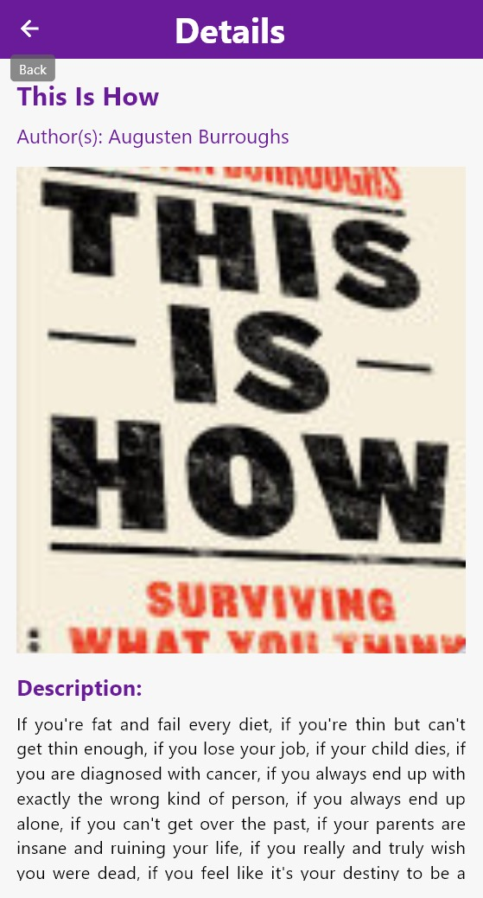
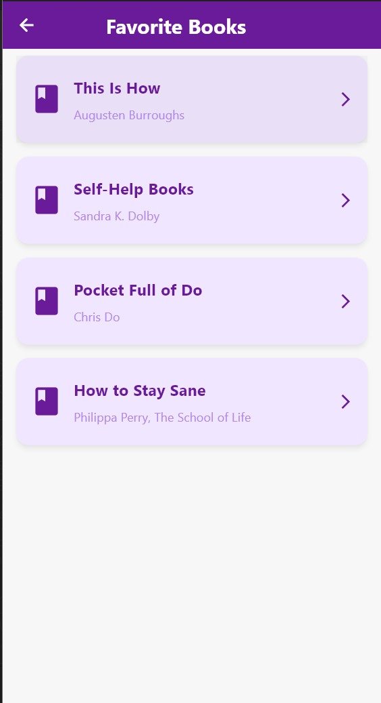

# Basic Book Discovery App 📚

A Flutter-based app designed to help users discover and explore books using the **Google Books API**. The app features a user-friendly interface with essential functionalities such as searching for books by categories, adding books to favorites, and viewing detailed information about each book.

This project was built with simplicity in mind, following best practices to ensure ease of navigation and an intuitive experience for users.

## Features 🚀

### 1. Splash Screen Animation

- Upon opening the app, users are welcomed with a **splash screen animation**, providing a smooth and engaging entry to the app. 
- This animation adds a polished look to the app and enhances the overall user experience.

### 2. User-Friendly Design

- The app follows a **clean and minimalist design** to ensure it's easy to use for everyone, even first-time users.
- A **purple and white color scheme** was chosen to maintain a simple yet attractive aesthetic. 
- The design keeps the interface calm, user-friendly, and visually appealing while ensuring that users focus on the core content—the books.

### 3. Integration with Google Books API

- The app integrates with the **Google Books API**, which provides a comprehensive and reliable source of book data, including images, descriptions, and additional metadata.
- Initially, we attempted to use the **Gutendex API**, but it failed to provide images and descriptions for the books, so we switched to Google Books API.
- The API provides access to thousands of books, allowing users to search for titles, authors, and more.

### 4. API Response Handling

- The app checks if the API is returning a valid response before attempting to display any data.
- **Error handling** is implemented using a **try-and-error method** in the `fetchBooks` function to gracefully handle edge cases.
- If the API returns an error or is unavailable, the app ensures that the user is notified with a user-friendly error message, preventing crashes or blank screens.

### 5. Favorites Feature

- Users can mark their favorite books and save them for quick access later.
- When a user adds a book to their favorites, it is saved locally on the device.
- Users can view and manage their favorite books without needing to search again.

### 6. Dynamic Categories Function

- The app features a **categories function** that enables users to browse books by different genres.
- When a user selects a category, the app triggers a new query to the Google Books API, refreshing the displayed book list with books relevant to that category.
- This functionality improves the app's usability by making it easy for users to discover books based on their interests.

### 7. Detailed Book View

- Each book listed in the app can be clicked on to open a **detailed view**.
- The detailed view displays important information such as:
    - Book title
    - Author name
    - Book description
    - Book cover image
    - Publisher
    - Publication date
    - And more.
- This allows users to make informed decisions about the books they want to explore further or add to their favorites.

### 8. Grid View Layout with Pagination

- Books are presented in a **grid view**, with **2 books displayed per row**.
- The layout ensures that the app is visually clean and that users can easily scroll through books.
- **Pagination** is implemented to allow an infinite number of columns.
- As users scroll down, new books are loaded automatically, thanks to the pagination feature of the Google Books API.

## Screenshots  

- **Home screen displaying books in a grid view**  
  

- **Book details page**  
  

- **Favorites Screen**  
  
  
## Getting Started 🛠️

### Prerequisites

Before running the app, ensure that you have the following tools installed:

1. **Flutter SDK**: Follow the [Flutter installation guide](https://flutter.dev/docs/get-started/install) to set up Flutter on your system.

2. **Clone the Repository**:
    ```bash
    git clone https://github.com/yourusername/basic-book-discovery-app.git
    cd basic-book-discovery-app
    ```

3. **Install Dependencies**:
    ```bash
    flutter pub get
    ```

### Run the App

1. Ensure that a device is connected or an emulator is running.
2. Launch the app using the following command:
    ```bash
    flutter run
    ```

## How It Works 💡

### Key Functions

#### 1. fetchBooks Function

- Responsible for fetching books from the Google Books API.
- Forms a query based on the user's search input or category selection.
- Sends a request to the API and processes the response.
- Uses a try-and-error mechanism to handle potential errors such as network issues or invalid responses.

#### 2. Categories Function

- Triggered when a user selects a category.
- Dynamically updates the displayed books by fetching a new set of books related to the chosen category.
- Refreshes the screen to reflect the new category selection.

#### 3. Favorites Management

- Provides an interface to add and remove books from the favorites list.
- Users can tap a heart icon to add a book to their favorites.
- Favorite book data is stored locally and persists after app closure.

## Tech Stack 🧰

- **Flutter**: Cross-platform mobile framework for app development
- **Dart**: Programming language used with Flutter
- **Google Books API**: External API for fetching book data
